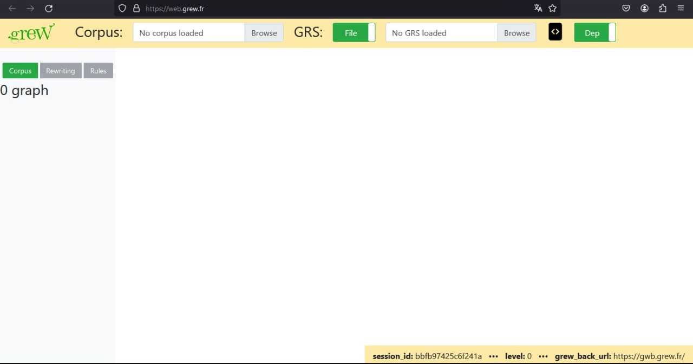
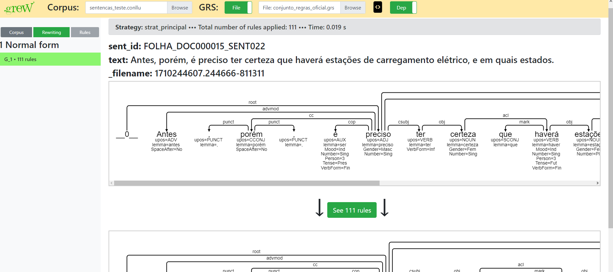

# Tranformação de UD para EUD na língua portuguesa

A aplicação utiliza o [Grew](https://grew.fr), uma ferramenta de reescrita em grafos para aplicações que envolvem Processamento de Linguagem Natural (PLN).

Esta ferramenta considera que cada sentença, que deve estar no formato .conllu, é uma árvore. Deste modo, a partir das regras inseridas (que devem estar no formato .grs), o programa analisa frase por frase, encontrando os padrões descritos nas regras e aplicando as mudanças relativas a aquele padrão.

## Exemplo de uso do Grew Web num conjunto de regras genérico no Grew Web
O [Grew Web](https://web.grew.fr) é a própria ferramenta disponível para ser acessada e testada de maneira online.

  

Para demonstrar o funcionamento do Grew, estarei utilizando o arquivo de regras 'teste.grs' e o arquivo conllu 'sentencas_teste.conllu'.

### Etapas para utilizar o Grew Web
- Insira o arquivo de sentencas no campo 'Corpus'
- Insira o arquivo de regras no campo 'GRS'
- Clique em uma das duas sentencas que aparece no lado direito
- Escolha a estratégia requerida (neste caso, é a única que aparece: strat_teste)
- Observe como cada regra foi aplicada ao grafo, podendo a mesma regra ter sido aplicada repetidas vezes dado o mesmo padrão encontrado.

  
</p
  
Nesta abordagem também é possível baixar o arquivo tranformado em formato .conllu e .json, os botões podem ser encontrados ao final da página.

## Exemplo de uso do Grew em máquina pessoal
O escritor deste tutorial tentou fazer a instalação citada abaixo num Windowns 11, porém sem sucesso. No entanto, o programa funcionou tanto em WSL quanto no Ubuntu, uma distribuição Linux bastante difundida.

- Siga o processo de instalação descrito [aqui](https://grew.fr/usage/install/).
- Digite o comando no terminal: eval $(opam env)
- Vá para a pasta ./ud_to_eud
- Digite o comando no terminal: grew transform -config iwpt -grs grs/iwpt_UD_to_MIX.grs -strat ud_to_mix -i ../sentencas_teste.conllu -o ../POS_ANOTACAO.conllu
  - Este comando considera dois arquivos: um de regras (iwpt_UD_to_MIX.grs) e outro com as sentenças a serem transformadas (teste.conllu). A saída gerada é escrita no arquivo POS_ANOTACAO.conllu .  
  - Para entender completamente este e outros comandos possíveis acesse [aqui](https://grew.fr/usage/cli/).

É válido notar que nesta abordagem *não* demonstra quais e quantas regras foram aplicadas para cada sentença. Para este objetivo siga o passo a passo no Grew Web.

## Scrapping para análise de uso das regras

