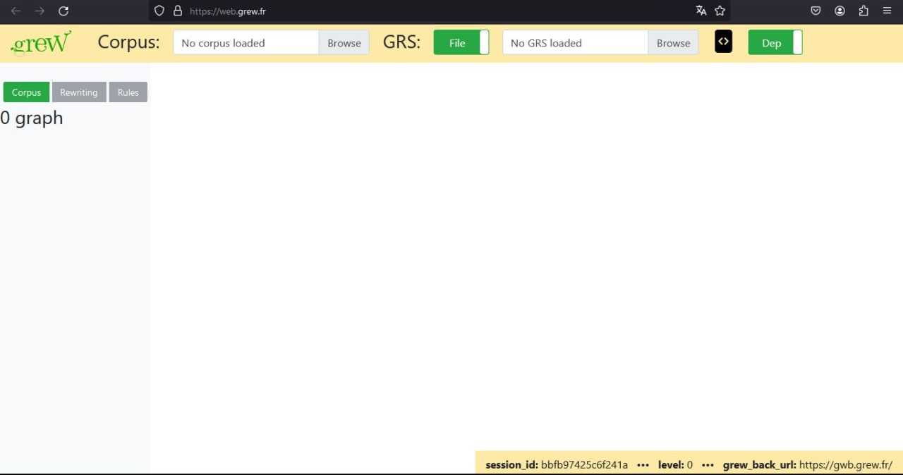
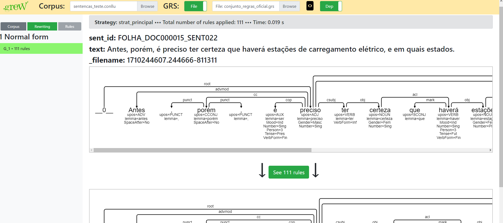

# Tranformação de UD para EUD na língua portuguesa
## Introdução
A aplicação utiliza o [Grew](https://grew.fr), uma ferramenta de reescrita em grafos para aplicações que envolvem Processamento de Linguagem Natural (PLN).

Esta ferramenta considera que cada sentença, que deve estar no formato .conllu, é uma árvore. Deste modo, a partir das regras inseridas (que devem estar no formato .grs), o programa analisa frase por frase, encontrando os padrões descritos nas regras e aplicando as mudanças relativas a aquele padrão.

## Objetivo

Universal Dependencies (UD) é um framework que possibilita a anotação consistente de gramática (partes da fala, características morfológicas e dependências sintáticas) em diferentes línguas humanas. UD é um esforço comunitário aberto com mais de 500 colaboradores produzindo mais de 200 bancos de árvores em mais de 100 línguas.

A representação de UD foi sempre destinada a ser usada em tarefas superficiais de compreensão de linguagem natural, como extração de relações ou extração de eventos biomédicos. A UD é adequada para tais tarefas, pois as árvores UD contêm muitas dependências diretas entre palavras de conteúdo. No entanto, para algumas construções, o caminho de dependência entre duas palavras de conteúdo pode ser muito longo em uma árvore UD, o que complica a determinação de como as palavras de conteúdo estão relacionadas. Além disso, alguns tipos de dependência são usados para muitos tipos diferentes de argumentos e modificadores, e portanto, não são muito informativos por si só. Por essas razões, também há diretrizes para uma representação aprimorada (enhanced), que torna algumas das relações implícitas entre palavras mais explícitas, e aumenta alguns dos rótulos de dependência para facilitar a desambiguação de tipos de argumentos e modificadores.

O objetivo principal desta aplicação é conseguir fazer com que sentenças escritas em língua portuguesa anotadas em UD, possam ser automaticamente re-anotadas para EUD (Enhanced Universal Dependencies). 

## Exemplo de uso do Grew Web num conjunto de regras genérico no Grew Web
O [Grew Web](https://web.grew.fr) é a própria ferramenta disponível para ser acessada e testada de maneira online.

  

Para demonstrar o funcionamento do Grew, estarei utilizando o arquivo de regras 'teste.grs' e o arquivo conllu 'sentencas_teste.conllu'.

### Etapas para utilizar o Grew Web
- Insira o arquivo de sentencas no campo 'Corpus'.
- Insira o arquivo de regras no campo 'GRS'.
- Clique em uma das duas sentencas que aparece no lado direito.
- Escolha a estratégia requerida (neste caso, é a única que aparece: strat_teste).
- Observe como cada regra foi aplicada ao grafo, podendo a mesma regra ter sido aplicada repetidas vezes dado o mesmo padrão encontrado.

  
</p
  
Nesta abordagem também é possível baixar o arquivo tranformado em formato .conllu e .json, os botões podem ser encontrados ao final da página.

## Exemplo de uso do Grew em máquina pessoal
O escritor deste tutorial tentou fazer a instalação citada abaixo num Windowns 11, porém sem sucesso. No entanto, o programa funcionou tanto em WSL quanto no Ubuntu, uma distribuição Linux bastante difundida.

- Siga o processo de instalação descrito [aqui](https://grew.fr/usage/install/).
- Digite o comando no terminal: eval $(opam env).
- Vá para a pasta ./ud_to_eud.
- Digite o comando no terminal: grew transform -config iwpt -grs grs/iwpt_UD_to_MIX.grs -strat ud_to_mix -i ../sentencas_teste.conllu -o ../POS_ANOTACAO.conllu.
  - Este comando considera dois arquivos: um de regras (iwpt_UD_to_MIX.grs) e outro com as sentenças a serem transformadas (teste.conllu). A saída gerada é escrita no arquivo POS_ANOTACAO.conllu .  
  - Para entender completamente este e outros comandos possíveis acesse [aqui](https://grew.fr/usage/cli/).

É válido notar que nesta abordagem *não* demonstra quais e quantas regras foram aplicadas para cada sentença. Para este objetivo siga o passo a passo no Grew Web.

## Scrapping para análise de uso das regras
Web Scrapping é uma forma de mineração que permite a extração de dados de sites da web convertendo-os em informação estruturada para posterior análise.
Neste projeto, o arquivo scrapping.py cria um 'bot' que segue as seguintes etapas:
- Abre o [Grew Web](https://web.grew.fr) no navegador firefox.
- Aplica um conjunto de regras e um corpus no site.
- Para cada sentença analisada:
  -  Capta o ID da sentença (presente no arquivo .conllu)
  -  Capta o pacote relacionado a regra aplicada
  -  Capta a regra aplicada
- Escreve estes dados num .csv de saída (aplicacoes.csv)

## Arquivo principal de anotação enhanced
Em esforços conjuntos entre pesquisadores brasileiros da área, o programa atual está em fase *alpha*, isto é, ainda não apresenta assertividade total para os diversos casos em que EUD possa estar relacionado na língua portuguesa.
O arquivo é o **conjunto_de_regras_oficial.grs**.
